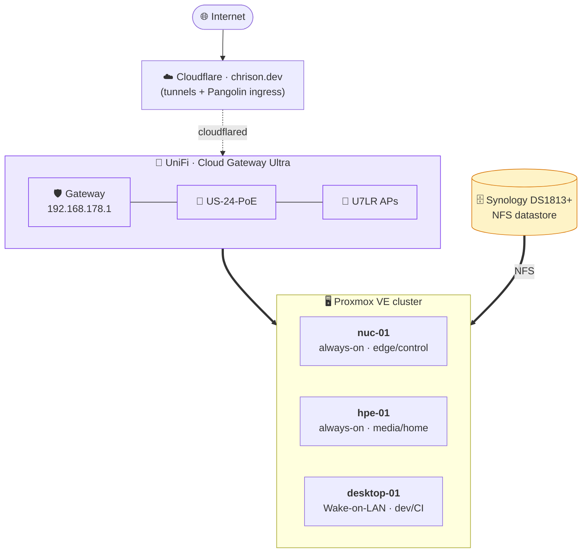
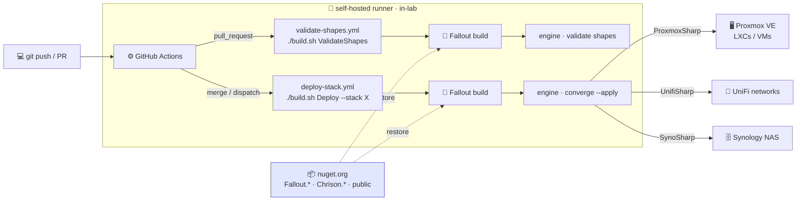

# Homelab

[](https://github.com/Chrison-Homelab/Homelab/actions/workflows/validate-shapes.yml)
[](https://github.com/Fallout-build/Fallout)
[](docs/adr/ADR-0001-iac-tooling.md)
[](global.json)
[](LICENSE)

> The single source of truth for my homelab. Infrastructure, configuration, and
> documentation **as code** — reconciled from Git, deployed by my own C#-native CI/CD.

This is an **eat-your-own-dogfood** repo: the lab is provisioned by a build engine
I wrote ([Fallout](https://github.com/Fallout-build/Fallout)) driving API clients I
wrote ([ProxmoxSharp](https://github.com/Chrison-dev/ProxmoxSharp) ·
[UnifiSharp](https://github.com/Chrison-dev/UnifiSharp) ·
[SynoSharp](https://github.com/Chrison-dev/SynoSharp)). If it isn't in the repo, it
doesn't exist.

---

## 🏗️ Architecture

Three Proxmox VE nodes + a Synology NAS behind a UniFi Cloud Gateway, fronted by
Cloudflare (cloudflared tunnels + Pangolin for public ingress). `desktop-01` is the
heavy node — it sleeps when idle and is woken on demand (Wake-on-LAN).



> **VLANs:** Homelab `10.10/16` · Consumer `10.20/16` · IoT `10.40/16` · Network
> devices `10.0/16` · legacy `192.168.178–179` (being retired). See
> [`docs/Network.md`](docs/Network.md).

## 🔁 Build & deploy

There is **no hand-written pipeline YAML for the logic**. A commit triggers GitHub
Actions on a **self-hosted runner** (in the lab, for LAN reach), which runs the
[Fallout](https://github.com/Fallout-build/Fallout) build (`./build.sh`) — a C#
console app. Fallout drives the **engine** (`Infrastructure/engine`), which
reconciles declared *shapes* (`stack.yaml`) against live state via our own API
clients. PRs `validate`; merges/dispatches `converge`.



```bash
./build.sh                      # default: ValidateShapes (validate all stacks)
./build.sh Preview --stack Core # dry-run converge for one stack
./build.sh Deploy  --stack Core # live apply
```

Requires the .NET 10 SDK (see [`global.json`](global.json)) and nothing else — every
package restores publicly from **nuget.org**: Fallout 10.4 (the build system) and the
`Chrison.*Sharp` clients alike. No feed credential, no `GITHUB_PACKAGES_PAT`. Git
guardrails (PR-only, no direct `main` push) are enforced client-side by a Husky.NET
`pre-push` hook.

## 🧩 Infrastructure — what runs where

Stacks are declared as `stack.yaml` *shapes*; domain stacks live in their own
**`Homelab.Stacks.*`** repos, composed here as submodules under `stacks/`
(meta-repo model, [ADR-0008](docs/adr/ADR-0008-stack-extraction-meta-repo.md)).

```mermaid
flowchart TB
  subgraph NUC["🟢 nuc-01 · always-on"]
    N1["Pangolin (ingress)"] --- N2["Traefik"] --- N3["cloudflared"] --- N4["Proxmox DC Manager"]
  end
  subgraph HPE["🟢 hpe-01 · always-on"]
    H1["🎬 Media · Plex + arr"] --- H2["📊 monitoring"] --- H3["🏠 Home Assistant"] --- H4["📡 IoT · MQTT/Matter/ESPHome"]
  end
  subgraph DESK["🌙 desktop-01 · Wake-on-LAN"]
    D1["Forgejo (+runner)"] --- D2["GitHub runners"] --- D3["ERP4FG"] --- D4["Topaz / Azure"]
  end

  classDef on fill:#dcfce7,stroke:#16a34a;
  classDef wol fill:#e0e7ff,stroke:#6366f1;
  class NUC,HPE on;
  class DESK wol;
```



| Stack | Repo | Runs |
|---|---|---|
| `SmartHome` | [Homelab.Stacks.SmartHome](https://github.com/Chrison-Homelab/Homelab.Stacks.SmartHome) | IoT/home-automation support layer for HA (MQTT, Matter, ESPHome, Leapmotor Mate) |
| `BuildLab` | [Homelab.Stacks.BuildLab](https://github.com/Chrison-Homelab/Homelab.Stacks.BuildLab) | Windows 11 VM to test the Fallout build across VS toolchains |
| `Azure` | [Homelab.Stacks.Azure](https://github.com/Chrison-Homelab/Homelab.Stacks.Azure) | Local Azure (Topaz emulator) |
| `DevOps` | [Homelab.Stacks.DevOps](https://github.com/Chrison-Homelab/Homelab.Stacks.DevOps) | Forgejo + runners, self-hosted DevOps |
| `Core` · `Media` · `monitoring` · `Gaming` | *in-tree* `stacks/` | Networking/edge · media fleet · Prometheus/Grafana · gaming VMs |

## 🧭 Principles

- **IaC-first** — declarative over imperative; UIs are a last resort.
- **Idempotent** — running the same thing twice changes nothing the second time.
- **Reversible** — changes roll back; destructive steps are explicit.
- **Modular** — small composable pieces; link and reuse, don't duplicate.
- **Multi-everything** — assume multiple nodes, multiple NAS, multiple services.

## 🗂️ What lives where

| Path | Purpose |
| --- | --- |
| [`build/`](build) | The Fallout build project (`Compile`/`ValidateShapes`/`Preview`/`Deploy`). |
| [`Infrastructure/`](Infrastructure) | The C#-native engine (`homelab-infra`) + the `shape` schema + node bootstrap. |
| [`stacks/`](stacks) | One stack per directory — mostly `Homelab.Stacks.*` submodules; each declares a `stack.yaml`. |
| [`src/Proxmox/`](src/Proxmox) | Bash + PowerShell node-bootstrap / inventory scripts (`.sh` + `.ps1` in sync). |
| [`vendor/`](vendor) | Our own API clients as submodules, dogfooded — `ProxmoxSharp` / `UnifiSharp` / `SynoSharp` (consumed from nuget.org). |
| [`docs/`](docs) | [Network](docs/Network.md), [devices](docs/Devices.md), [services](docs/Services.md), [ADRs](docs/adr), and plans. |
| [`tools/PowerOrchestrator/`](tools/PowerOrchestrator) | Demand-driven node sleep/wake (WoL) — powers `desktop-01` down when idle. |

## ⚙️ The stack, end to end

- **Build system:** [Fallout](https://github.com/Fallout-build/Fallout) — my C#/.NET
  build system (a NUKE successor). Build logic is code, not YAML.
- **Engine:** `Infrastructure/engine` (`homelab-infra`) — validates + converges shapes.
- **API clients (dogfooded, on nuget.org):**
  [`Chrison.ProxmoxSharp`](https://www.nuget.org/packages/Chrison.ProxmoxSharp) ·
  [`Chrison.UnifiSharp`](https://www.nuget.org/packages/Chrison.UnifiSharp) ·
  `Chrison.SynoSharp`.
- **Ingress:** Cloudflare tunnels + [Pangolin](docs/adr/ADR-0007-pangolin-remote-access.md).
- **Decisions:** see the [ADRs](docs/adr) (0001 IaC tooling → 0008 meta-repo model).

## 🔗 Links

- [Proxmox VE API](https://pve.proxmox.com/wiki/Proxmox_VE_API) · [Synology DSM API](https://global.download.synology.com/download/Document/Software/DeveloperGuide/Package/FileStation/All/enu/Synology_File_Station_API_Guide.pdf)
- [Fallout](https://github.com/Fallout-build/Fallout) — the build system behind all of this.
