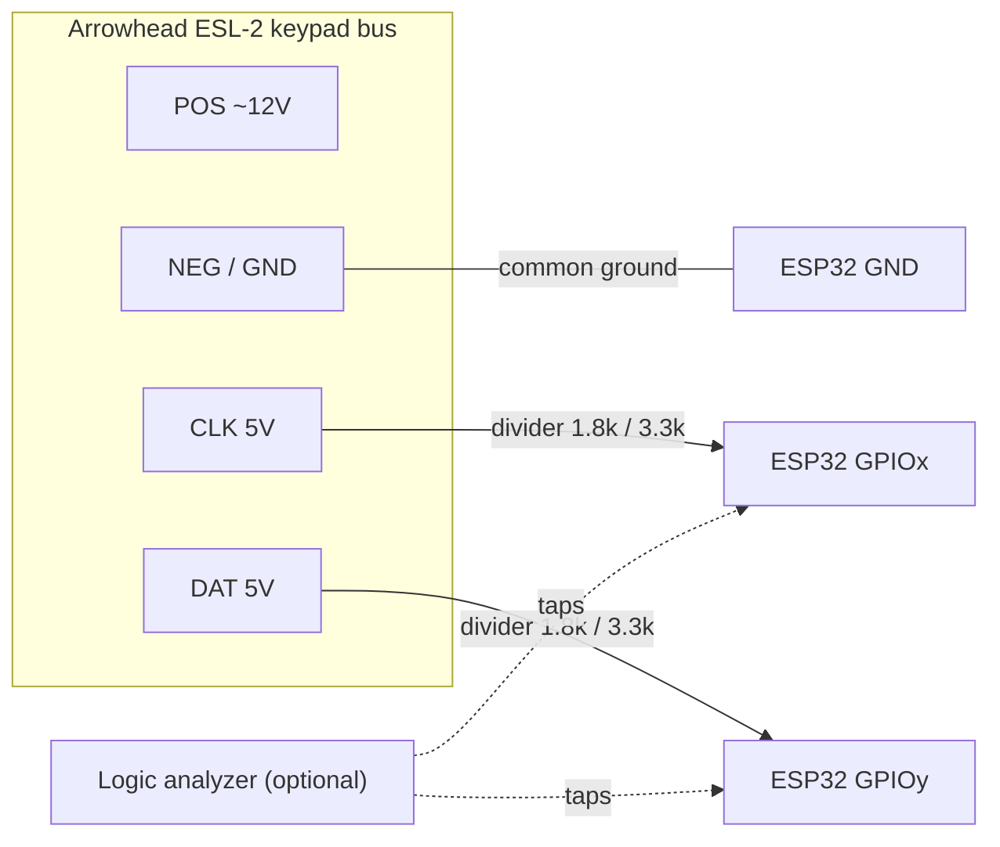

# ESL-2 Bridge — Phase-0 hardware testing checklist

Bench-setup for the **read-only keypad-bus tap** on the Arrowhead ESL-2 (ELITE-S).
Goal: sniff `CLK/DAT`, confirm the real bus clock rate, and capture `10000001`-flagged
frames — with gear on hand plus a couple of cheap parts.

Tracking: [#255](https://github.com/Chrison-dev/Homelab/issues/255) (build) ·
[#263](https://github.com/Chrison-dev/Homelab/issues/263) (this checklist).
See also [`../README.md`](../README.md).

## Bill of materials

**Have on hand / already planned**

- **ESP32** (240 MHz) — capture MCU. Alternatively a **Raspberry Pi 1 rev B** running
  `sivann/crowalarm` as an independent cross-check.
- **USB cable + laptop** — flash + serial monitor.

**Need at the bench (essential, read-only)**

- **Resistors for 2 voltage dividers** (one each on CLK + DAT), ~2:1 to drop 5 V → ~3.3 V.
  E.g. **R1 1.8 kΩ / R2 3.3 kΩ** (Vout ≈ 3.24 V) or 10 k/20 k. 4 resistors total.
- **Breadboard + DuPont/jumper wires** — build the dividers solderless.
- **Multimeter** — identify terminals + confirm divider output ≈3.3 V **before** touching
  an ESP32 GPIO.

**Strongly recommended**

- **Cheap 8-ch USB logic analyzer** (Saleae clone) — directly answers "confirm the real
  clock rate" and lets you see the `10000001` flag frames without trusting firmware yet.
  De-risks the C# nanoFramework vs C++ decision.

**Phase 2 (control) only — NOT needed for Phase 0**

- Bi-directional logic-level converter (TXS0108E / BSS138).
- Relay module (keyswitch-simulation alt path).

## Wiring



Resistor divider, per line (CLK and DAT). Vout = 5 × 3.3 / 5.1 ≈ **3.24 V**:

```
Panel CLK (5V) ──[ R1 1.8k ]──┬── ESP32 GPIO  (≈3.24V)
                              │
                          [ R2 3.3k ]
                              │
Panel NEG ────────────────────┴── ESP32 GND   (common ground)
```

- **Common ground is mandatory** — ESP32 GND ↔ panel NEG, or the CLK/DAT readings are
  meaningless.
- Power the ESP32 from **laptop USB**, not the panel's 12 V rail, for the first tap.
- Do **not** wire POS (12 V) to the ESP32 — it is the rail, not a signal.

## Verification steps (in order)

1. Multimeter: identify POS/NEG/CLK/DAT; confirm CLK/DAT swing ≈5 V.
2. Build dividers on breadboard; multimeter-confirm output ≈3.3 V **before** connecting to
   the ESP32.
3. Logic analyzer on the divided CLK/DAT: observe frames, measure clock period (expected
   hundreds of µs–1 ms), confirm the `10000001` flag.
4. Only then flash capture firmware and read on the ESP32.

## ⚠️ Safety

Live security panel — **read-only tap only**; never disrupt its own monitoring/dialler.
Sample DAT on CLK falling edge, DAT active-low (firmware note).
